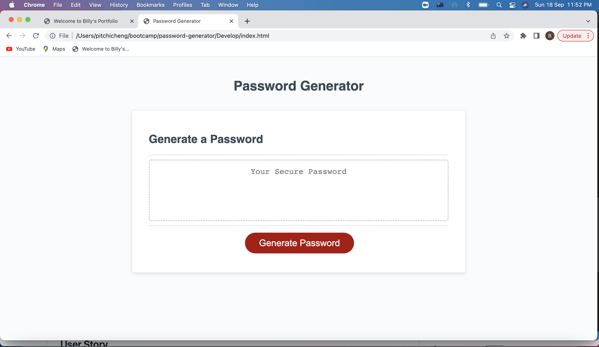
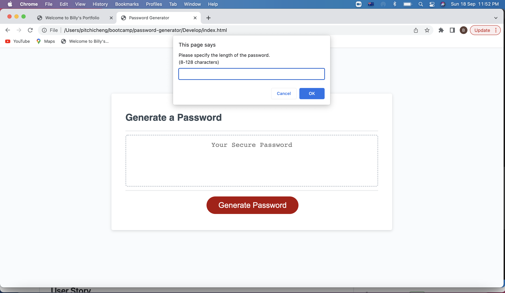
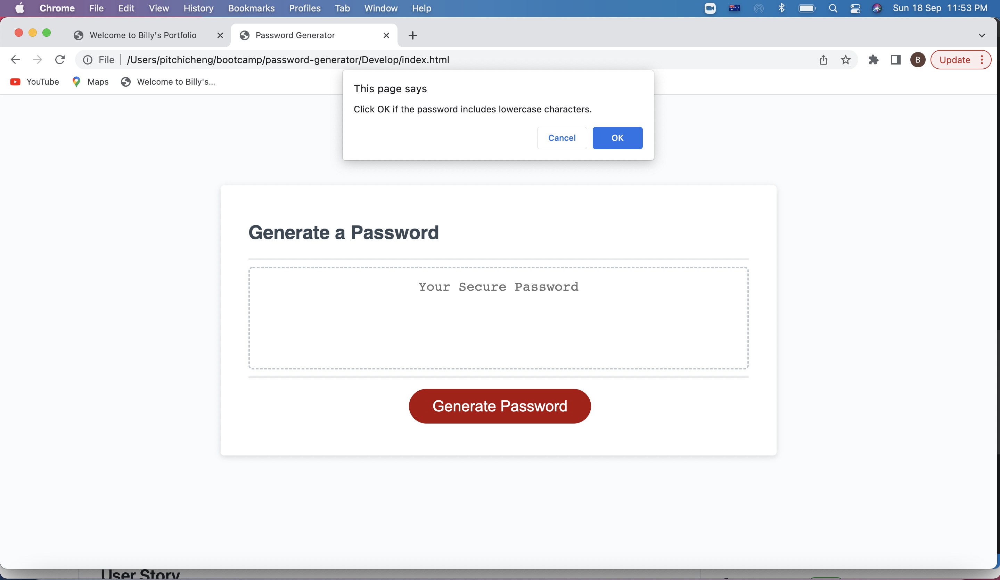
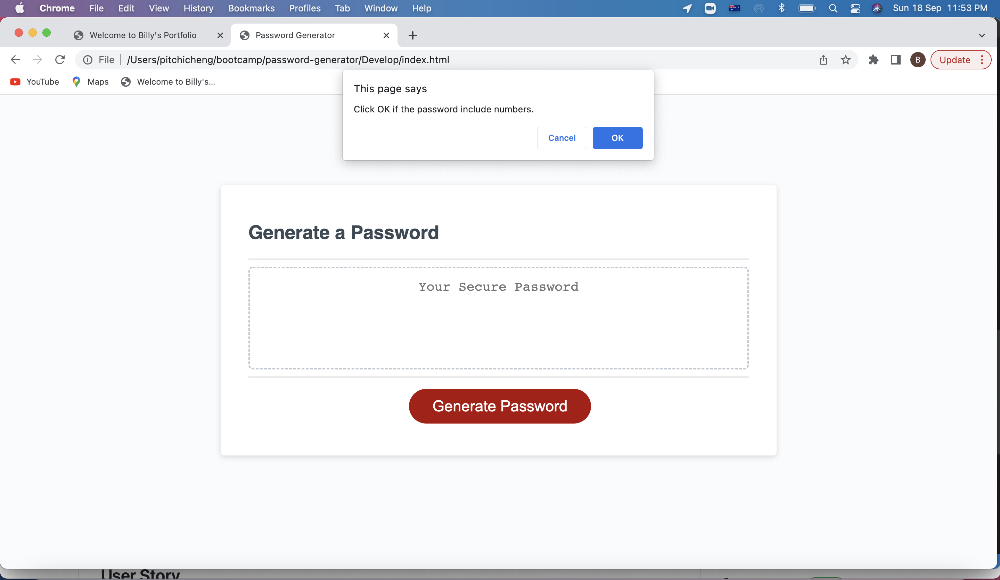
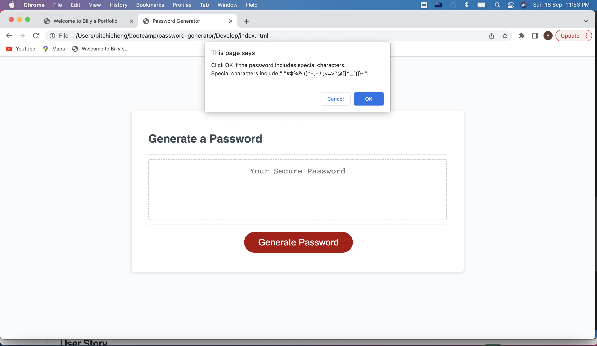

# Password Generator

## Your Task

This is the Challenge after completing the Unit 3 (JavaScript) of Adelaide University Coding Bootcamp.

## User Story

```
AS AN employee with access to sensitive data
I WANT to randomly generate a password that meets certain criteria
SO THAT I can create a strong password that provides greater security
```

## Acceptance Criteria

```
GIVEN I need a new, secure password
WHEN I click the button to generate a password
THEN I am presented with a series of prompts for password criteria
WHEN prompted for password criteria
THEN I select which criteria to include in the password
WHEN prompted for the length of the password
THEN I choose a length of at least 8 characters and no more than 128 characters
WHEN asked for character types to include in the password
THEN I confirm whether or not to include lowercase, uppercase, numeric, and/or special characters
WHEN I answer each prompt
THEN my input should be validated and at least one character type should be selected
WHEN all prompts are answered
THEN a password is generated that matches the selected criteria
WHEN the password is generated
THEN the password is either displayed in an alert or written to the page
```

## Solution

Steps to resolve the Challenge:

1. Create function generatePassword() in script.js file.  

2. Declare variables and set the prompt screens to collect the user inputs. 

3. Store the user inputs to the variables. 

4. Valid the user inputs against the requirements.  If the user input is invalid, prompt message to notify user and quit the function by returning an empty string password to the main function.  

5. If the user inputs are valid, generate a password based on the selected criteria. 

6. After generating the password, check the password whether all the required character types are included in the password.  If not, regenerate the password until all the required character types are included. 

7. If a valid password is gererated, return the valid password to the main function. 

<br>

## Testing Strategy and Result

The testing will be separated into 2 parts, testing on valid criteria and exception test. 

### Test Cases on valid criteria: 

| Test Case | Password Length | uppercase | lowercase | numbers | special characters |                                                           Password Generated                                                           | Result |
|:---------:|:---------------:|:---------:|:---------:|:-------:|:------------------:|:--------------------------------------------------------------------------------------------------------------------------------------:|:------:|
|     1     |        8        |    Yes    |    Yes    |   Yes   |         Yes        |                                                                d.9[}A!U                                                                |  Pass  |
|     2     |        10       |     No    |    Yes    |    No   |         Yes        |                                                               [\|k..o<+j,                                                              |  Pass  |
|     3     |       128       |    Yes    |     No    |   Yes   |         Yes        | J[Q.HR\`#,W&:U}\`LBL"%N!U0J?'+-. 5A*0?<15L:^@)SA\`[7P7GAP>:N&. \`Z(>\|U0:>PZ}}G+%?7-O=W0J%,"<Z \|;-T{Z?GXL@U(Y25]K%'QAY (_:DX3~~;*B$7-[!OB |  Pass  |
|     4     |        60       |     No    |     No    |    No   |         Yes        |                                     ,<~}.,(;{.<!\`{^,[>_^-*\`$,}^)}!&. )#__`.&==[;>#.%%:^#>\|)?_(^(^                                     |  Pass  |

<br>

### Exception Tests: 

| Test Case | Testing Criteria                                                 | Expected Behavior                                                                         | Actual Behavior | Result |
|:---------:|------------------------------------------------------------------|-----------------------------------------------------------------------------------------|:-------------:|:------:|
|     1     | Click Cancel when asking length of password                      | Quit function with no message.                                                          |  As expected  |  Pass  |
|     2     | Input "abc" when asking length of password                       | Quit function with message to notify user an integer input is needed                    |  As expected  |  Pass  |
|     3     | Input "10.5" when asking length of password                      | Quit function with message to notify user an integer input is needed                    |  As expected  |  Pass  |
|     4     | Input nothing when asking length of password                     | Quit function with message to notify user the value must be between 8 and 128           |  As expected  |  Pass  |
|     5     | Input 2 when asking length of password                           | Quit function with message to notify  user the value must be between 8 and 128          |  As expected  |  Pass  |
|     6     | Input 129 when asking length of password                         | Quit function with message to notify user the value must be between 8 and 128           |  As expected  |  Pass  |
|     7     | Click Cancel to all of the prompts on  selecting character types | Quit function with message to notify  user at least one character type must be selected |  As expected  |  Pass  |

<br>

## Live URL 

https://chengpitchi.github.io/password-generator/

<br>

## Screenshots for the Solution


<br>

<br>

<br>

<br>

<br>

<br>

<br>

## Installation

No Installation requried.

## License 

Not Applicable
